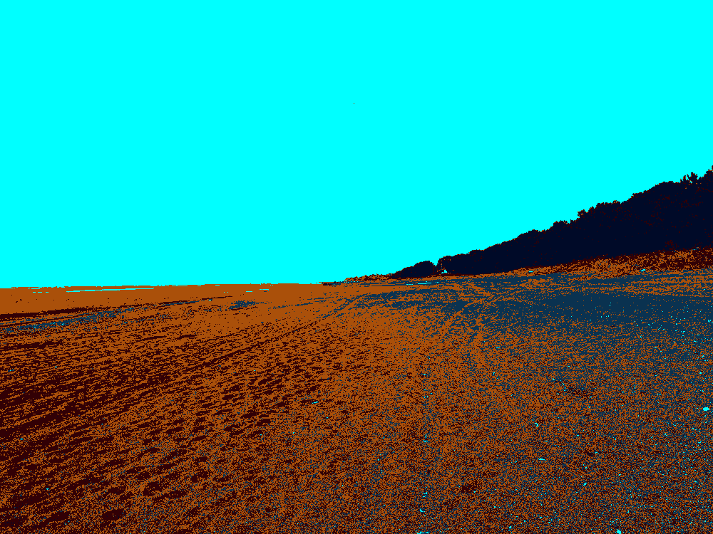

# Hadean Vision


[](https://github.com//hasesuns/hadean-vision-api/actions/workflows/python-package-ci.yml)
[](https://github.com/psf/black)



A recreation the image processing of the third part of the "Stargate Sequence" (from ["2001: A Space Odyssey"](https://en.wikipedia.org/wiki/2001:_A_Space_Odyssey_(film)) ).

# How to use as a library

`$ pip install git+ssh://git@github.com:hasesuns/hadean-vision-api.git`

```python
from hadeanvision.convert_picture import ConvertParams, convert

input_img = cv2.imread("./beach.jpg")
convert_params = ConvertParams(  # sample vals
    num_colors = 5,
    rgb_list =[(0, 255, 255), (10, 50, 80), (170, 80, 10), (50, 0, 5), (0, 10, 40)]  
)
output_img = convert(input_img, convert_params)

cv2.imwrite(output_img_path, "./beach_hadean.png")

```

## Sample

|input|output|
|---|---|
|||

## todo
- Use original luminance information
- Support for video input

